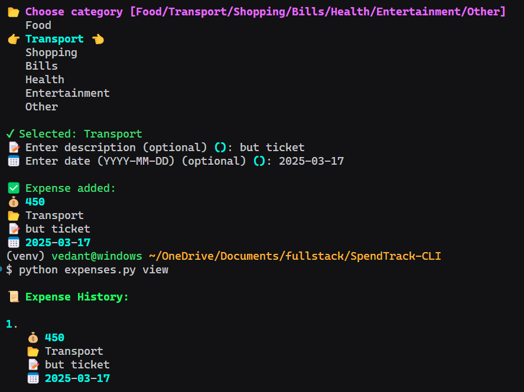

📌 **A simple and basic CLI tool to track expenses easily!**

  


🔗 **Check it out on GitHub:** [SpendTrack-CLI](https://github.com/VedantKulkarni05/SpendTrack-CLI)


---

## 🚀 Features

✔️ **Add expenses** with categories and descriptions  
✔️ **View all expenses** in a formatted list  
✔️ **Delete expenses** by ID  
✔️ **Expense summary** by category  
✔️ **Persistent storage** (JSON-based)

---

## 📦 Installation

### **1️⃣ Clone the Repository**

```bash
git clone https://github.com/yourusername/SpendTrack-CLI.git
cd SpendTrack-CLI
```

### **2️⃣ Create a Virtual Environment (Optional, Recommended)**

```bash
python -m venv venv
source venv/bin/activate  # On macOS/Linux
venv\Scripts\activate  # On Windows
```

### **3️⃣ Install Dependencies**

```bash
pip install -r requirements.txt
```

### 🎮 Usage

### **➕ Add an Expense**

```bash
python expenses.py add 500 "Food" "Lunch at a cafe"
```

### **📜 View Expense History**

```bash
python expenses.py view
```

### 📜 Expense History:

### 1. 💰 500 - 📂 Food - 📝 Lunch at a cafe - 📅 2025-03-17

### **🗑 Delete an Expense**

```bash
python expenses.py delete 1
```

### **📊 Expense Summary**

```bash
python expenses.py summary
```

### 📊 Expense Summary:

### 📂 Food: 💰 500.00

### ⚡ Screenshots
<p align="center">
  
</p>


### ✨ "This is clean, modern, and to the point! Feel free to fork the project and make it even better! 🚀"


